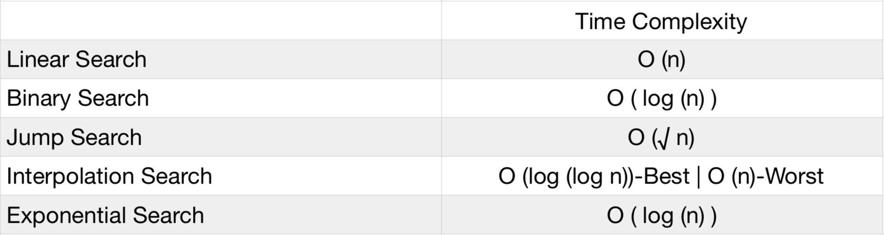

# Searching algorithms implementation in python 



## Running main

To run main you have to provide your list as spaces delimited sequence to *--lst* and
element you want to find index of to *--el* .

Example: 

```bash
python main.py --lst 1 2 3 4 5 --el 5
```

## Requirements

No specific requirements for this project yet. If any, to install them:

```bash
pip install -r requirements.txt
```

## License

This project is licensed under the MIT License - see the [LICENSE](LICENSE) file for details.
